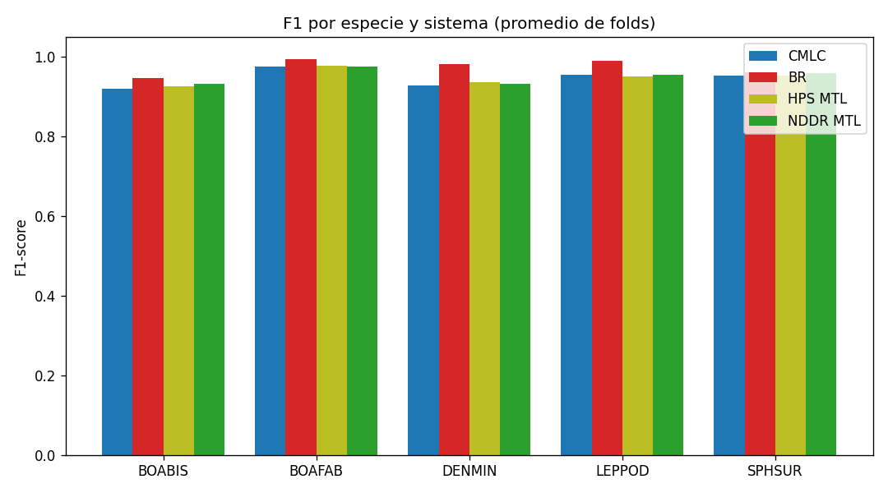
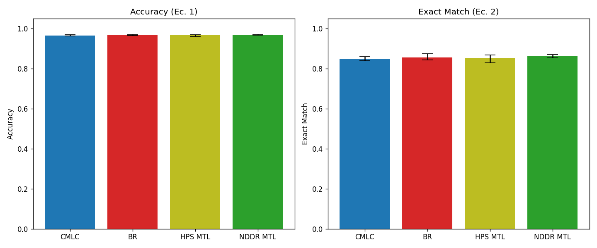
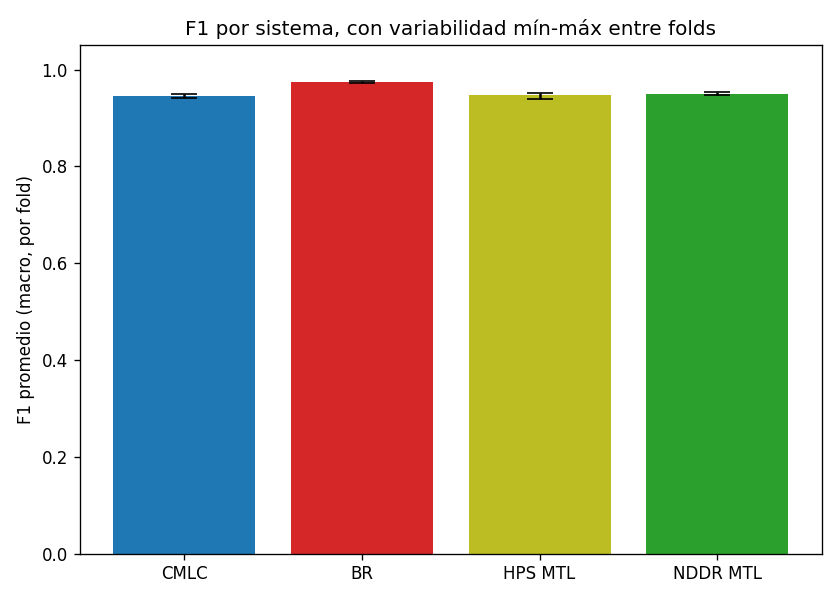
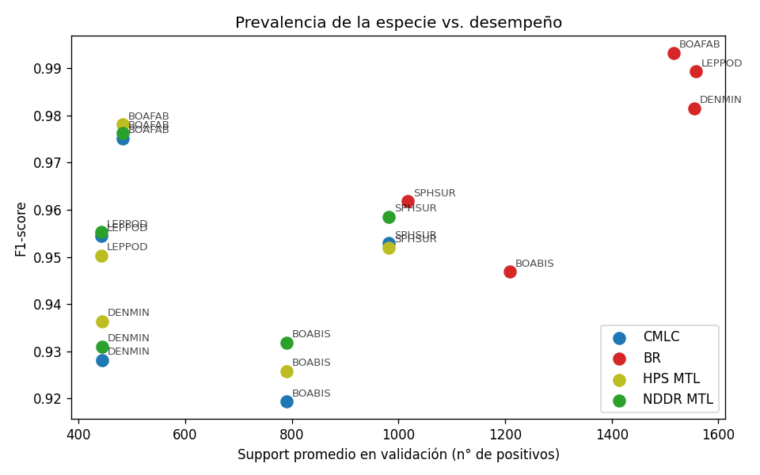
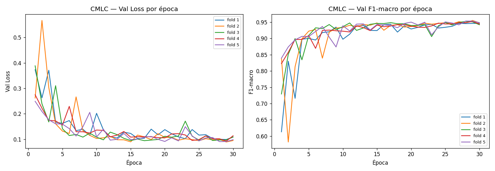
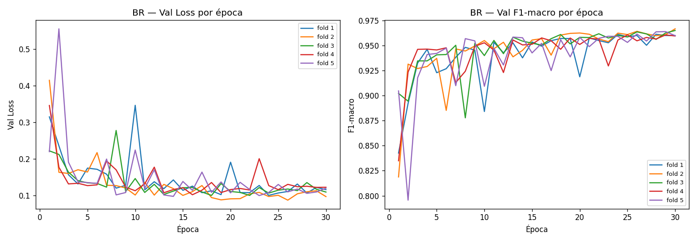
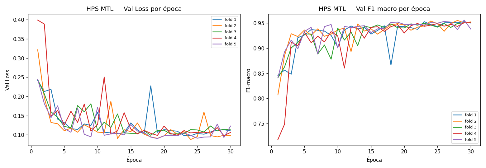
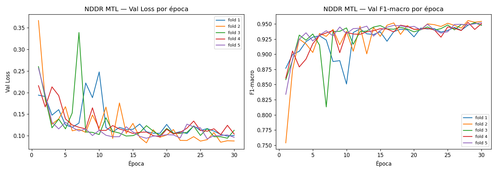
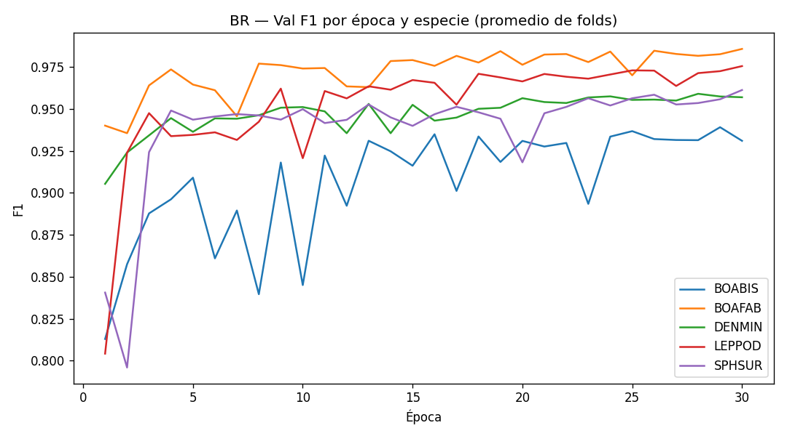
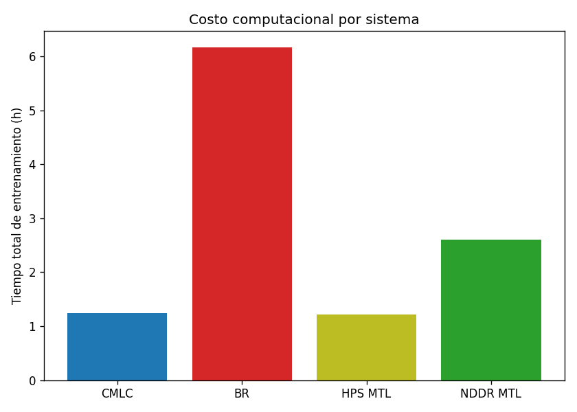

# CMLC / BR / HPS MTL / NDDR MTL — Clasificación multi-etiqueta de anuros

Implementación de los 4 sistemas de clasificación multi-etiqueta comparados en
Olcay et al. (2026), *"How to analyse overlapping sounds in the marine
environment using supervised multi-label classification"* (npj Acoustics),
adaptados a un dataset de anuros de la Amazonía (42 especies, 62,191 clips de
audio de 3s). Todo el entrenamiento corrió en el cluster Khipu vía Slurm.

## Diferencias respecto a la propuesta original del paper

| Aspecto | Paper original | Esta implementación | Justificación |
|---|---|---|---|
| N° de clases (estudio comparativo) | 5 | 5 (`--top_n_classes 5`) | Iguala la escala exacta del paper, permitiendo comparar los 4 sistemas de forma fiel — con las 42 especies completas, BR/HPS/NDDR serían inviables en el tiempo disponible |
| N° de muestras (estudio comparativo) | ~15,500 (curado) | 10,000 (`--max_samples 10000`) | Reduce el costo computacional; se preservan todos los positivos de las clases elegidas antes de rellenar con negativos, evitando desbalance artificial |
| K-Fold | K=4 (75/25 por fold) | K=5 (80/20 por fold) | El enunciado del laboratorio pide split 80/20; K=5 lo logra exactamente, manteniendo el enfoque de validación cruzada del paper |
| Épocas | 100 (sin early stopping) | 30 | Convergencia empírica observada muy temprana (F1-macro de 0.58 a 0.84 en las primeras 2 épocas, ver curvas más abajo); `--lr_decay_steps` escalado proporcionalmente (90→27) para mantener el mismo patrón relativo de decaimiento |
| Representación de entrada | MS-PCEN, 96 kHz | MS-PCEN, 22.05 kHz (`n_fft`/`hop_length` recalculados para preservar la misma duración de ventana de 21 ms y 64 bandas Mel) | El dataset de anuros está a 22.05 kHz, no 96 kHz |
| Predicciones finales de test | — | CMLC entrenado sobre el dataset **completo** (42 especies, 62,191 clips) | CMLC escala mejor a más clases (una sola red compartida) que BR (necesitaría 42 redes independientes); se usa solo para la entrega final, no para el estudio comparativo |

## Estructura del repositorio

```
.
├── README.md
├── src/            código fuente (ver tabla abajo)
├── notebooks/       analisis_resultados.ipynb — genera todas las tablas y graficas de abajo
├── graficas/         PNG ya generados por el notebook
└── resultados/       CSV de cada sistema (metricas por epoca, finales, dataset usado)
```

## Archivos en `src/`

| Archivo | Qué hace |
|---|---|
| `config.py` | Hiperparámetros fijos de audio (MS-PCEN) y arquitectura CRNN |
| `audio_features.py` | Cálculo de MS-PCEN / Mel-spectrogram simple desde WAV |
| `model.py` | Las 4 arquitecturas (CMLC, BR, HPS MTL, NDDR MTL) implementadas en PyTorch desde cero |
| `train.py` | Script de entrenamiento unificado (`--system cmlc\|br\|hps\|nddr`); maneja K-Fold, checkpointing, resume, cache de features y reducción de dataset |
| `precompute_features.py` | Precomputa y cachea MS-PCEN (o Mel simple, para la ablación) una sola vez, evitando recalcularlo en cada época |
| `predict_test.py` | Genera predicciones sobre el test set, promediando (ensemble) los 5 checkpoints de fold ya entrenados |
| `compute_paper_metrics.py` | Calcula Accuracy y Exact Match (Ecuaciones 1 y 2 del paper) corriendo inferencia sobre los folds de validación con los checkpoints ya entrenados, sin reentrenar |
| `precompute_khipu.sh` | Job Slurm: precómputo de features (K=5, 10,000 clips) |
| `CMLC_khipu.sh` / `BR_khipu.sh` / `HPS_khipu.sh` / `NDDR_khipu.sh` | Jobs Slurm de entrenamiento de cada sistema (K=5) |
| `predict_test_khipu.sh` | Job Slurm: predicciones de test (CPU, no reentrena) |
| `compute_paper_metrics_khipu.sh` | Job Slurm: Accuracy/Exact Match (CPU, no reentrena) |
| `submit_chain.sh` | Reenvía un job automáticamente (`--dependency=afterany`) si no termina en las 8h de límite de Slurm |
| `precompute_ablation_khipu.sh` | Job Slurm: precómputo de la ablación (Mel-spectrogram simple, sin PCEN) |
| `CMLC_ablation_khipu.sh` | Job Slurm: entrena CMLC sobre Mel simple, para comparar contra MS-PCEN |
| `precompute_full_khipu.sh` | Job Slurm: precómputo del dataset completo (42 especies, 62,191 clips) |
| `CMLC_full_khipu.sh` | Job Slurm: entrena CMLC sobre el dataset completo, para las predicciones finales de test |

Los 19 archivos se usan activamente; no hay código muerto en `src/`.

## Configuración del entorno (una vez, en el nodo de acceso de Khipu)

```bash
module purge
module load gnu12/12.4.0
module load python3/3.11.11

python3 -m venv ~/venvs/cmlc
source ~/venvs/cmlc/bin/activate
pip install --upgrade pip

module load cuda/12.6
pip install torch --index-url https://download.pytorch.org/whl/cu121
pip install numpy pandas librosa scikit-learn
```

Verificar: `python3 -c "import torch; print(torch.__version__)"` debe mostrar
algo como `2.5.1+cu121` (no `+cpu`).

## Orden de ejecución

```bash
# Estudio comparativo (K=5, 10,000 clips)
sbatch precompute_khipu.sh      # una sola vez, ~5 min
sbatch CMLC_khipu.sh            # ~1.24h
sbatch BR_khipu.sh              # ~6.17h (25 redes independientes)
sbatch HPS_khipu.sh             # ~1.22h
sbatch NDDR_khipu.sh            # ~2.61h

# Metricas del paper y predicciones de test (CPU, no reentrenan)
sbatch compute_paper_metrics_khipu.sh cmlc
sbatch compute_paper_metrics_khipu.sh br
sbatch compute_paper_metrics_khipu.sh hps
sbatch compute_paper_metrics_khipu.sh nddr
sbatch predict_test_khipu.sh cmlc
sbatch predict_test_khipu.sh br
sbatch predict_test_khipu.sh hps
sbatch predict_test_khipu.sh nddr

# Si algun job no termina en 8h:
./submit_chain.sh BR_khipu.sh br
```

Ablación y entrega final (42 especies) — ver secciones correspondientes más
abajo para el detalle de resultados.

```bash
# Ablacion: MS-PCEN vs Mel-spectrogram simple
sbatch precompute_ablation_khipu.sh
sbatch CMLC_ablation_khipu.sh
sbatch compute_paper_metrics_khipu.sh cmlc_nopcen cmlc features_cache_nopcen

# Dataset completo (42 especies) para la entrega final de test
sbatch precompute_full_khipu.sh
sbatch CMLC_full_khipu.sh
sbatch predict_test_khipu.sh cmlc_full cmlc features_cache_full
```

## Resultados

Todas las tablas y gráficos de esta sección se generan automáticamente con
`notebooks/analisis_resultados.ipynb`, a partir de los CSV en `resultados/`.

### Tabla 1 — F1-score por especie y sistema (promedio de 5 folds)

| Especie | CMLC | BR | HPS MTL | NDDR MTL |
|---|---|---|---|---|
| BOABIS | 0.9193 | 0.9468 | 0.9258 | 0.9319 |
| BOAFAB | 0.9752 | 0.9932 | 0.9780 | 0.9762 |
| DENMIN | 0.9281 | 0.9815 | 0.9364 | 0.9310 |
| LEPPOD | 0.9544 | 0.9893 | 0.9503 | 0.9553 |
| SPHSUR | 0.9529 | 0.9618 | 0.9520 | 0.9585 |
| **Promedio** | **0.9460** | **0.9745** | **0.9485** | **0.9506** |



**Análisis:** BR gana en las 5 especies, coincidiendo con el hallazgo central
del paper original (*"el sistema BR logró el mejor desempeño MLC"*). BOAFAB es
la especie más fácil de clasificar en los 4 sistemas; BOABIS y DENMIN son las
más difíciles — patrón consistente entre arquitecturas, sugiriendo que la
dificultad es propia de la especie (posible solape acústico con otras clases)
y no un artefacto de una arquitectura en particular.

### Tabla 2 — Accuracy y Exact Match (Ecuaciones 1 y 2 del paper)

| Sistema | Accuracy | Exact Match |
|---|---|---|
| CMLC | 0.9654 | 0.8475 |
| BR | 0.9680 | 0.8564 |
| HPS MTL | 0.9669 | 0.8539 |
| **NDDR MTL** | **0.9688** | **0.8612** |



**Análisis:** por estas dos métricas los 4 sistemas quedan mucho más parejos
que por F1 (diferencia máxima de ~0.34 puntos porcentuales en Accuracy), con
NDDR MTL levemente adelante — no BR. Esto muestra que el ranking puede
depender de qué métrica se prioriza: F1-macro pondera igual a las 5 especies
sin importar su prevalencia, mientras que Accuracy pondera por etiqueta
individual (dominada por las clases mayoritarias). Ambas métricas coinciden,
eso sí, en que BR y NDDR MTL están a la cabeza.

### Variabilidad entre folds



Barras de error mín-máx entre los 5 folds — todos los sistemas muestran
variabilidad baja y similar entre sí (ningún fold particular resultó
atípicamente fácil o difícil), señal de que el split K=5 quedó bien
balanceado.

### Prevalencia de la especie vs. desempeño



**Análisis:** a diferencia de lo que se esperaría ingenuamente ("más datos,
mejor desempeño"), BOAFAB tiene **baja prevalencia** (~450-500 positivos) pero
el **F1 más alto** de las 5 especies en los 4 sistemas; BOABIS tiene **alta
prevalencia** (~800-1200) pero el **F1 más bajo**. Esto sugiere que, en este
dataset, la dificultad de clasificación está más ligada a qué tan distintivo
es el llamado de la especie (posible solapamiento acústico con otras especies
del dataset) que a la cantidad de ejemplos de entrenamiento disponibles —
un matiz distinto al hallazgo del paper original sobre datasets marinos, donde
la representación en el dataset de entrenamiento sí era el factor dominante.

### Curvas de entrenamiento






**Análisis:** los 4 sistemas convergen dentro de las primeras ~10 épocas,
confirmando la decisión de usar 30 en vez de 100 (ver tabla de diferencias más
arriba). Se observan picos aislados de inestabilidad en `val_loss` en todos
los sistemas (más marcados en HPS MTL y NDDR MTL, que tienen arquitecturas más
complejas) que se recuperan en 1-2 épocas — ruido normal de entrenamiento sin
early stopping (igual que hace el paper original), no una señal de fallo.



**Análisis (BR por especie):** BOAFAB y LEPPOD convergen más rápido y a un F1
más alto que BOABIS y SPHSUR — consistente con la Tabla 1. BOABIS muestra la
curva más ruidosa de las 5, con oscilaciones notables incluso pasada la época
20, reforzando que es la especie acústicamente más difícil de distinguir.

### Costo computacional



| Sistema | Tiempo total | s/época promedio |
|---|---|---|
| CMLC | 1.24h | 29.6s |
| HPS MTL | 1.22h | 29.2s |
| NDDR MTL | 2.61h | 62.6s |
| BR | 6.17h | 29.6s (× 25 redes independientes) |

**Análisis:** BR y NDDR MTL —los 2 sistemas de mejor desempeño— cuestan 5x y
2.1x más tiempo que CMLC/HPS MTL, respectivamente. BR es más costoso no porque
cada red individual sea lenta (mismo costo por época que CMLC), sino porque
entrena 25 redes independientes (5 clases × 5 folds) en vez de una sola. Esta
relación desempeño/costo es exactamente la que motiva usar **CMLC** —el más
eficiente— para la entrega final con las 42 especies completas, donde BR
sería inviable (requeriría 210 redes independientes en vez de 25).

## Ablación: MS-PCEN vs. Mel-spectrogram simple

Se entrenó CMLC dos veces bajo condiciones idénticas —mismo split, mismas 5
especies, mismos 10,000 clips, mismos hiperparámetros— cambiando únicamente
la representación de entrada de audio.

| Métrica | MS-PCEN | Mel simple | Diferencia |
|---|---|---|---|
| F1 macro | 0.9460 | 0.9397 | +0.0063 |
| Accuracy | 0.9654 | 0.9635 | +0.0019 |
| Exact Match | 0.8475 | 0.8376 | +0.0099 |

| Especie | MS-PCEN | Mel simple | Diferencia |
|---|---|---|---|
| BOABIS | 0.9193 | 0.9214 | -0.0021 |
| BOAFAB | 0.9752 | 0.9710 | +0.0041 |
| DENMIN | 0.9281 | 0.9143 | +0.0138 |
| LEPPOD | 0.9544 | 0.9352 | +0.0192 |
| SPHSUR | 0.9529 | 0.9564 | -0.0035 |

**Análisis:** MS-PCEN mejora las tres métricas globales, pero por un margen
modesto (menos de 1 punto porcentual en todos los casos) — una diferencia
mucho más pequeña que la que sugeriría la motivación metodológica del paper
original. A nivel de especie, la ventaja tampoco es uniforme: en BOABIS y
SPHSUR, Mel simple obtuvo un F1 marginalmente mejor. El beneficio de MS-PCEN
se concentra en DENMIN y LEPPOD. Una explicación plausible es que las
grabaciones de campo de anuros en la Amazonía —al menos las de las 5 especies
más frecuentes del dataset— tengan condiciones de ruido de fondo más estables
que el entorno marino para el que el paper reporta el hallazgo original,
reduciendo el margen de mejora que aporta la normalización de energía por
canal de PCEN.

## Entrega final: CMLC con las 42 especies completas

*(Pendiente de completar — ver `CMLC_full_khipu.sh` y
`predict_test_khipu.sh cmlc_full cmlc features_cache_full`.)*

## Notas prácticas

- **Checkpointing:** cada fold guarda su estado cada `--checkpoint_every`
  épocas; con `--resume`, un job interrumpido retoma exactamente donde quedó.
- `--max_seconds 28300` corta el entrenamiento limpiamente (guardando
  checkpoint) antes de que Slurm mate el job por el límite de 8h.
- Si `results_final.csv`/`results_epochs.csv` de un sistema necesitan
  rehacerse desde cero, borrar checkpoints y resultados juntos:
  `rm -rf checkpoints/<sistema> resultados/<sistema>` (nunca borrar solo uno,
  para no mezclar filas viejas y nuevas en el mismo CSV).
- `compute_paper_metrics_khipu.sh` y `predict_test_khipu.sh` aceptan 2
  argumentos opcionales (arquitectura, subcarpeta de cache) para variantes que
  usan otra carpeta de checkpoints pero la misma arquitectura (ablación,
  dataset completo) — ver ejemplos en "Orden de ejecución" arriba.
